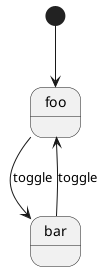

# FooLogic Example

A simple example of using LogicBlocks in a Godot project. This demonstrates a basic state machine that toggles between two states: `foo` and `bar`.

## Structure

```
.
├── fooLogic/
│   ├── fooLogic.cs           # Main logic block class
│   ├── fooLogic.State.cs     # Base state definition
│   ├── fooLogic.Input.cs     # Input definitions
│   ├── fooLogic.Output.cs    # Output definitions
│   └── states/
│       ├── fooLogic.State.foo.cs  # foo state
│       ├── fooLogic.State.bar.cs  # bar state
│       └── fooLogic.puml     # State diagram
└── FooNode.cs                # Godot node that uses the logic block
```

## State Machine

The state machine has two states that toggle between each other:
- `foo` (initial state)
- `bar`

Each state:
- Outputs a `StateChanged` message when attached
- Handles the `toggle` input to switch to the other state

When the "toggle_state" input action is triggered, the state machine switches between these states.

## Setup

1. Add "toggle_state" to your Godot project's Input Map (Project Settings -> Input Map)
2. Map it to your desired key/button
3. Add `FooNode` to your scene
4. Run the game and press the mapped key to see state changes

## Generated Diagram

The state machine diagram is automatically generated in `fooLogic.g.puml`:



## Dependencies

- Chickensoft.LogicBlocks
- Chickensoft.LogicBlocks.DiagramGenerator
- Chickensoft.Introspection.Generator